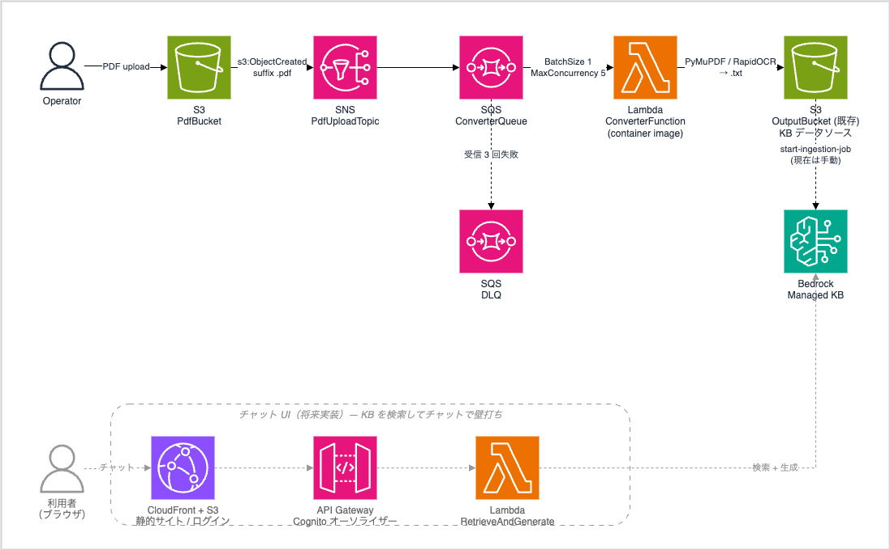
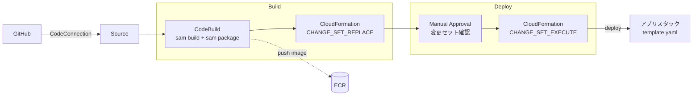

# interview-copilot / PDF 取り込みパイプライン

PDF を **テキスト化して Bedrock Managed Knowledge Base のデータソース（S3）へ流し込む** サブシステム。



太線 = プロビジョニング対象。`boot` は手動で 1 回デプロイ、`app` はパイプラインが作成/更新する。
`OutputBucket` / `Bedrock KB` は既存リソース（名前 / ID で参照するだけ）。

Amazon Textract が日本語 OCR 非対応のため、変換を自前で持つ。最終的には、この KB に
フロントエンド（静的サイト + API Gateway + Lambda）を繋いでチャットボットを実装する予定で、
本リポジトリはその **取り込み側** を担う（点線部分は未実装）。

- テキストレイヤーがある PDF は PyMuPDF で抽出（ほとんどのケース）
- スキャン PDF は **RapidOCR（PP-OCRv4 / 日本語, onnxruntime・CPU）** にフォールバック
- 変換は Python 単独で完結（外部 API 依存なし）


## 実行時の設計ポイント

- **SNS を挟む** のは将来 SQS/Lambda を足して処理を並列に増やせるようにするため
- SQS が DLQ とリトライを担当。Lambda は例外を素通しし、SQS の再配信 → DLQ に任せる
- `BatchSize: 1`（OCR は CPU バウンドでバッチにすると並列度が落ちる。並列度は `ScalingConfig.MaximumConcurrency` で調整）
- **Managed KB は CloudFormation 未対応** のため管理外。ID 参照のみ（再取り込みは手動）
- KB を挟んで取り込み側と読み取り側（チャット）が疎結合になる想定

## CI/CD（SAM + CodePipeline、2 スタック）



- パイプライン（`codepipeline.yml`）とアプリ（`template.yaml`）は別スタック。パイプラインがアプリをデプロイするため自己参照を避ける
- Build で変更セットを **作成だけ** し、Deploy の承認後に **実行** する
- `sam build` がコンテナイメージをビルド → `sam package` が ECR へ push（zip の 250MB 制限を超えるためイメージ配布）

## リポジトリ構成

```
├─ src/
│  ├─ pdf_to_text_local.py   変換コア + CLI（AWS 非依存）
│  ├─ pdf_to_text_lambda.py  Lambda ハンドラ（S3 入出力のみ）
│  ├─ Dockerfile             Lambda コンテナイメージ
│  ├─ requirements.txt       実行時依存
│  └─ .dockerignore
├─ template.yaml             アプリスタック（SAM）
├─ codepipeline.yml          CI/CD ブートストラップ
├─ buildspec.yml             Build ステージ（sam build + package）
├─ samconfig.toml            ローカル sam 用デフォルト
├─ pyproject.toml            ruff 設定 / 開発ツール
└─ docs/architecture.drawio
```

## ローカル開発

```bash
python3.13 -m venv venv && source venv/bin/activate
pip install -r src/requirements.txt
pip install ruff cfn-lint boto3   # 開発ツール

# CLI で 1 ファイル変換
python src/pdf_to_text_local.py document.pdf
python src/pdf_to_text_local.py scan.pdf --ocr always --dpi 300

# lint / テンプレート検証
ruff check . && ruff format --check .
cfn-lint template.yaml codepipeline.yml
sam validate --lint

# コンテナで動作確認（Docker 要）
sam build
sam local invoke ConverterFunction -e events/sqs-test.json --env-vars env.json
```

OCR モデル（PP-OCRv4 の 3 ファイル ≈ 15MB）は初回実行時に ModelScope から自動 DL、
`site-packages/rapidocr/models/` にキャッシュ。イメージには `sam build` 時に焼き込まれる。

## デプロイ

1. GitHub への **CodeConnection を作成・承認**（AWS コンソール、初回のみ）
2. このリポジトリを GitHub に push
3. パイプラインのブートストラップスタックをデプロイ:

   ```bash
   aws cloudformation deploy \
     --template-file codepipeline.yml \
     --stack-name interview-copilot-pipeline \
     --capabilities CAPABILITY_IAM \
     --parameter-overrides \
       ConnectionArn=arn:aws:codeconnections:<REGION>:<ACCOUNT_ID>:connection/<UUID> \
       RepositoryId=<owner>/<repo>
   ```

4. パイプラインが自動実行される。**Deploy ステージの承認**で変更セットを確認して承認
5. アプリスタック `interview-copilot-pdf` が作成される。`PdfBucket` に PDF を置くと
   `OutputBucket` に `.txt` が現れる
6. KB へ反映（現状は手動）:

   ```bash
   aws bedrock-agent start-ingestion-job \
     --knowledge-base-id <KB_ID> --data-source-id <DATA_SOURCE_ID>
   ```

## コスト

全リソースがイベント / リクエスト課金。常時稼働のコンピュートなし。

| 固定費 | 概算 |
|---|---|
| ECR ストレージ（イメージ ~1.5GB） | ~¥15-25 / 月 |
| S3 / CloudWatch Logs 保管 | 数円 / 月 |

## 運用メモ

- **DLQ**: `interview-copilot-pdf-to-text-dlq`。変換に 3 回失敗した PDF が入る。
  S3→SNS 通知の初期化時に飛ぶ `s3:TestEvent` も 1 件入るので、初回は空にしてよい
- **再取り込み**: 変換後の KB 反映は手動 `start-ingestion-job`（自動化は将来）
- **メディア抽出**: KB データソースの `mediaExtractionConfiguration` は image/audio/video を
  `DISABLED` にする（テキストオンリー方針）
